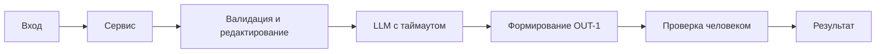

# ADR: решение для первого рабочего сценария

- Статус: proposed / accepted
- Дата: 2026-09-10
- Ответственные: команда курса / студент

## Контекст

Учебный сервис «AI-помощник ревьюера PR» получает diff и возвращает рекомендации. В текущем diff добавлены: POST `/api/reviews` (app/api.py:8–10) и метод `ReviewService.review`, который отправляет полный diff во внешний LLM и возвращает `{"comment": answer}` (app/review_service.py:13–16). Это расходится с правилами SEC-1, API-1, REL-1, OUT-1 (CASE.md:64–71).

## Решение

В рамках первого инкремента внедрить минимальные изменения без перестройки архитектуры:
- На уровне API проверять размер `diff`; если > 20 000 символов — возвращать HTTP 413 (API-1).
- Перед вызовом LLM применять редактирование секретов в prompt (SEC-1).
- Вызывать LLM с таймаутом 10 секунд и преобразовывать ошибку в контролируемый ответ (REL-1).
- Привести формат ответа к OUT-1: `summary`, `risks` (≤3, с `file,line,evidence,risk`), `checks`.

## Рассмотренные альтернативы

| Альтернатива | Почему не выбрали сейчас |
|---|---|
| Полная замена LLM на локальную модель | Не соответствует цели кейса; усложняет окружение |
| Синхронная потоковая генерация без таймаута | Нарушает REL-1 и повышает риск зависаний |
| Отложенная обработка через очередь | Избыточно для первого инкремента; нет требований |

## Последствия и главный риск

- Положительные последствия:
  - Соблюдение правил SEC-1, API-1, REL-1, OUT-1; улучшение предсказуемости API.
- Ограничения:
  - Возможна потеря деталей при редактировании; ограничение размера diff может требовать разбиения.
- Главный риск:
  - Неверная или недостаточная редакция секретов приводит к утечке (SEC-1).
- Как проверим риск:
  - Unit: дифф с тестовыми токенами/ключами → в prompt заменены на [REDACTED].

## Архитектурная схема

## Как использовали AI

- Для чего: зафиксировать минимальное решение и риски.
- Тип промпта: master prompt.
- Строка в [`prompts.md`](prompts.md): P1-02.
- Что проверили и исправили сами: сопоставили решение с подтверждёнными расхождениями SEC-1, API-1, REL-1, OUT-1 и ссылками file:line.
