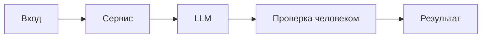

# ADR: решение для первого рабочего сценария

- Статус: proposed
- Дата: 2026-09-04
- Ответственные: команда backend; владелец продукта практики

## Контекст

AS IS: API `/api/reviews` принимает `payload["diff"]` и возвращает `{"comment": str}` (app/api.py:8‑10; app/review_service.py:16). `ReviewService` формирует prompt с сырым diff и вызывает внешний `llm.generate()` (app/review_service.py:14‑15). Нарушены правила OUT‑1 (формат ответа), SEC‑1 (удаление секретов), API‑1 (ограничение длины diff), REL‑1 (timeout/ошибки).

## Решение

В сервис добавить:
- Предобработку diff: маскирование секретов по SEC‑1 перед включением в prompt.
- Проверку длины diff в API: >20 000 символов → HTTP 413 (API‑1).
- Обёртку LLM с timeout 10 сек и преобразованием ошибки в контролируемый ответ (REL‑1).
- Формирование структурированного ответа по OUT‑1: `summary`, ≤3 `risks[file,line,evidence,risk]`, `checks`.
Решение человека остаётся обязательным (SCOPE‑1). Логи ограничены метаданными (OBS‑1).

## Рассмотренные альтернативы

| Альтернатива | Почему не выбрали сейчас |
|---|---|
| Делегировать форматирование в UI | Нарушает OUT‑1 на уровне сервиса; сложнее тестировать сервером |
| Полностью отказаться от LLM | Противоречит цели кейса; теряем ценность подсказок |
| Отложить SEC‑1 до «потом» | Риск утечки секретов выше приемлемого |

## Последствия и главный риск

- Положительные последствия:
- Соответствие правилам; предсказуемые тайм‑ауты; структурированный, проверяемый ответ.
- Ограничения: возможное ложное срабатывание маскировки; отказ длинных diff; дополнительные ветки кода.
- Главный риск: недокументированные секреты всё ещё могут просочиться в prompt при недостаточной маскировке.
- Как проверим риск: unit с искусственным секретом; integration с proxy, проверяющим содержимое prompt; проверка «[REDACTED]» вместо секретов.

## Архитектурная схема

## Как использовали AI

- Для чего:
- Зафиксировать компромиссное решение и отклонённые альтернативы.
- Тип промпта: master prompt.
- Строка в [`prompts.md`](prompts.md): P1‑02.
- Что проверили и исправили сами: сопоставили каждое утверждение с evidence `file:line` или id правила; риски выведены из CASE.md и diff.
