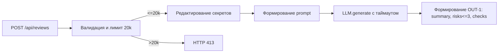

# Анализ процесса: AS IS и TO BE

## AS IS

Пользователь отправляет HTTP POST на `/api/reviews` c JSON `{"diff": "..."}`. Функция `create_review` извлекает `payload["diff"]` и вызывает `review_service.review` (app/api.py:8–10). `ReviewService.review` формирует строковый prompt: `"Review this pull request and find problems:\n{diff}"`, затем вызывает `self.llm.generate(prompt)` и возвращает словарь `{"comment": answer}` (app/review_service.py:13–16). Ручные операции: проверка результата выполняется человеком вне сервиса (SCOPE-1). Точки риска: секреты могут уйти в prompt (SEC-1), нет ограничений по размеру diff (API-1), нет таймаута/обработки ошибок внешнего LLM (REL-1), структура ответа не соответствует OUT-1.

## TO BE

Минимальный инкремент: сервис принимает diff, удаляет секреты, отклоняет слишком длинные diff с 413, формирует prompt и вызывает LLM с таймаутом 10с; результат приводит к структуре OUT-1: `summary`, `risks` (≤3), `checks`. Ошибки LLM превращаются в контролируемый ответ.

## Разница

| Что меняется | AS IS | TO BE | Как проверим изменение |
|---|---|---|---|
| Формат ответа | {"comment": answer} | {summary, risks<=3, checks} | e2e: проверить схему OUT-1 |
| Секреты в prompt | Не редактируются | Редактируются [REDACTED] | unit: токен → [REDACTED] |
| Ограничение размера diff | Нет | 413 при >20k | integration: 21k → 413 |
| Таймаут LLM | Нет | 10 секунд, контролируемая ошибка | integration: LLM >10s → контролируемый ответ |

## Как использовали AI

- Для чего: описать AS IS по diff и целевой минимальный TO BE по правилам CASE.md.
- Тип промпта: master prompt.
- Строка в [`prompts.md`](prompts.md): P1-02.
- Что проверили и исправили сами: верифицировали file:line и сопоставили с SEC-1, API-1, REL-1, OUT-1.
