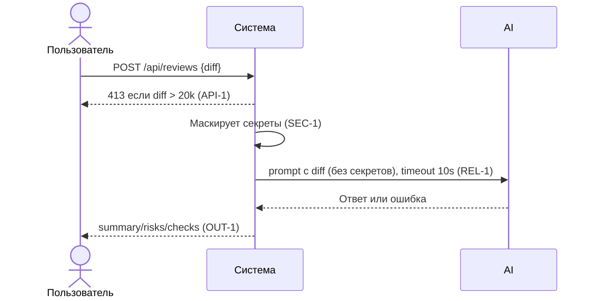

# Use cases и user stories

## Первый рабочий сценарий

**Когда** ревьюер отправляет diff PR в сервис через POST `/api/reviews`, **система** валидирует размер, маскирует секреты, запрашивает LLM с таймаутом и возвращает структурированный результат (`summary`, `risks`, `checks`), **а пользователь получает** проверяемый список рисков и действий проверки. Evidence: app/api.py:8‑10; app/review_service.py:14‑16; правила CASE.md `API‑1`, `SEC‑1`, `REL‑1`, `OUT‑1`.

Не входит в этот сценарий:

- Автоматический approve/merge, коммиты и правки в коде (SCOPE‑1).

## Use case

| Поле | Значение |
|---|---|
| Актор | Ревьюер PR |
| Триггер | Отправлен запрос POST `/api/reviews` с `diff` |
| Предусловия | Доступен сервис; diff ≤20 000 символов |
| Основной результат | Ответ в формате OUT‑1: `summary`, ≤3 `risks[file,line,evidence,risk]`, `checks` |
| Ошибка или отказ | Если diff >20 000 символов — HTTP 413 (API‑1); при таймауте LLM — контролируемый ответ (REL‑1) |



## User stories и acceptance criteria

```gherkin
Feature: Ревью PR с помощью LLM

  Scenario: Позитивный
    Given diff длиной 1000 символов без секретов
    When отправляем POST /api/reviews с diff
    Then получаем 200 и JSON с полями summary, risks (<=3), checks

  Scenario: Негативный или граничный
    Given diff длиной 25000 символов
    When отправляем POST /api/reviews с diff
    Then получаем 413 Payload Too Large
```

## Как использовали AI

- Для чего:
- Привязать сценарии к правилам и AS IS коду, оформить проверяемые критерии.
- Тип промпта: master prompt.
- Строка в [`prompts.md`](prompts.md): P1‑02.
- Что проверили и исправили сами: проверили соответствие формулировок правилам CASE.md и evidence из diff; избегали не подтверждённых деталей.
