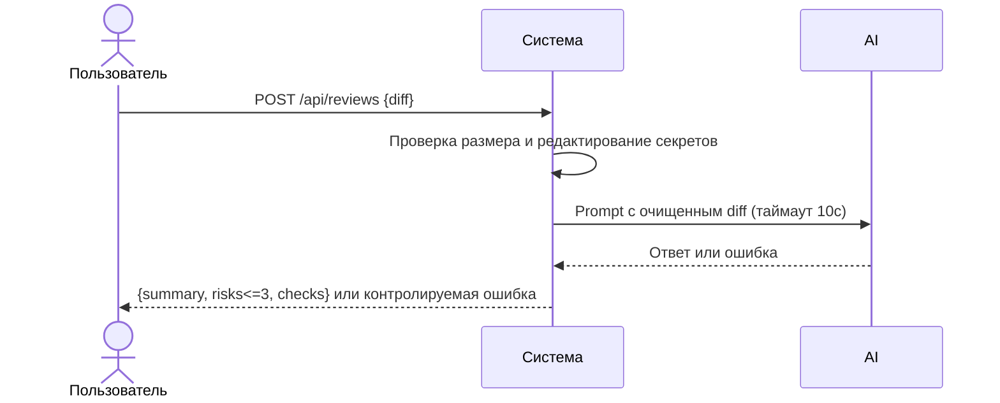

# Use cases и user stories

## Первый рабочий сценарий

Когда разработчик отправляет diff PR в `/api/reviews`, система валидирует размер, редактирует секреты и вызывает LLM с таймаутом, а пользователь получает структурированный результат с `summary`, ≤3 `risks` и `checks` для ручной проверки.

Не входит в этот сценарий:

- Автоматическое принятие решений по PR (approve/merge). Источник: SCOPE-1.
- Изменение кода в репозитории пользователя.
- Логирование содержимого diff или ответа модели (OBS-1 запрещает).

## Use case

| Поле | Значение |
|---|---|
| Актор | Разработчик/ревьюер PR |
| Триггер | POST `/api/reviews` с телом `{"diff": "..."}` |
| Предусловия | Доступность API сервиса; размер diff ≤ 20 000 символов |
| Основной результат | JSON `{summary, risks(≤3), checks}` |
| Ошибка или отказ | HTTP 413 при diff > 20k; контролируемый ответ при таймауте/ошибке LLM |



## User stories и acceptance criteria

```gherkin
Feature: Получение структурированного ревью PR

  Scenario: Позитивный
    Given API доступен и diff длиной 5000 символов
    When отправляю POST /api/reviews c телом {"diff": "..."}
    Then получаю 200 OK и JSON с полями summary, risks (не более 3), checks
    And значения соответствуют схеме OUT-1

  Scenario: Негативный или граничный
    Given diff длиной 21000 символов
    When отправляю POST /api/reviews
    Then получаю 413 Payload Too Large
    And тело содержит указание на лимит 20000
```

## Как использовали AI

- Для чего: описать сценарии использования и критерии приёмки на основе правил OUT-1, API-1, SEC-1, REL-1.
- Тип промпта: master prompt.
- Строка в [`prompts.md`](prompts.md): P1-02.
- Что проверили и исправили сами: проверили, что сценарии опираются на подтверждённые правила и evidence из diff.
