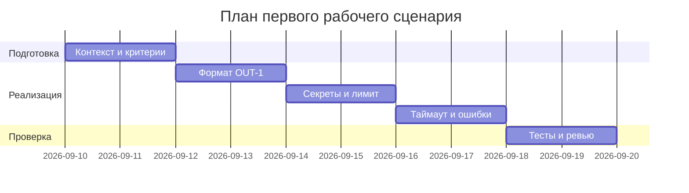

# План поставки

## Инкременты и ответственность

| Инкремент | Наблюдаемый результат | Что делает человек | Что делает AI или субагент | Проверка | Зависимости |
|---|---|---|---|---|---|
| 1 | Ответ формата OUT-1 | Определяет схему ответа и acceptance | Генерирует черновик трансформации ответа | e2e: проверка схемы | OUT-1 |
| 2 | Редактирование секретов | Уточняет перечень секретов | Предлагает regex/фильтры для [REDACTED] | unit: токен → [REDACTED] | SEC-1 |
| 3 | Ограничение 20k и 413 | Решает UX текста ошибки | Предлагает middleware/валидацию | integration: 21k → 413 | API-1 |
| 4 | Таймаут 10с и обработка | Определяет поведение контролируемой ошибки | Подсказывает паттерн таймаута | integration: задержка >10s | REL-1 |

## Диаграмма Ганта

Замените даты и задачи на свой план.

## Как использовали AI

- Для чего: разложить минимальные инкременты и проверки по правилам.
- Тип промпта: master prompt.
- Строка в [`prompts.md`](prompts.md): P1-02.
- Что проверили и исправили сами: синхронизировали план с SEC-1, API-1, REL-1, OUT-1.
