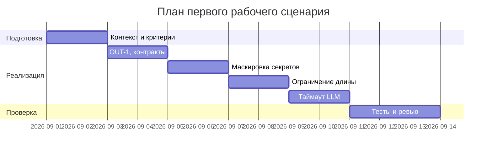

# План поставки

## Инкременты и ответственность

| Инкремент | Наблюдаемый результат | Что делает человек | Что делает AI или субагент | Проверка | Зависимости |
|---|---|---|---|---|---|
| 1 | Определён формат OUT‑1 и контракты | Уточняет схему ответа, фиксирует в ADR | Генерирует черновик схемы | Code review схемы, валидатор | CASE.md |
| 2 | Предобработка diff: маскировка секретов | Уточняет шаблоны секретов | Предлагает regex/алгоритм маскировки | Unit с тестовыми секретами | SEC‑1 |
| 3 | Ограничение размера diff | Решает порог и текст ошибки | Добавляет проверку длины | Integration 413 | API‑1 |
| 4 | Таймаут LLM и контролируемый ответ | Решает формат ошибки | Предлагает обёртку вызова | Integration с эмуляцией таймаута | REL‑1 |
| 5 | E2E‑путь с проверяемыми результатами | Принимает решение по результатам | Прогоняет сценарии | E2E сценарии | 1‑4 |

## Диаграмма Ганта

Замените даты и задачи на свой план.

## Как использовали AI

- Для чего:
- Составить инкременты и проверки, привязанные к правилам.
- Тип промпта: master prompt.
- Строка в [`prompts.md`](prompts.md): P1‑02.
- Что проверили и исправили сами: проверили согласованность зависимостей и соответствие DoD.
